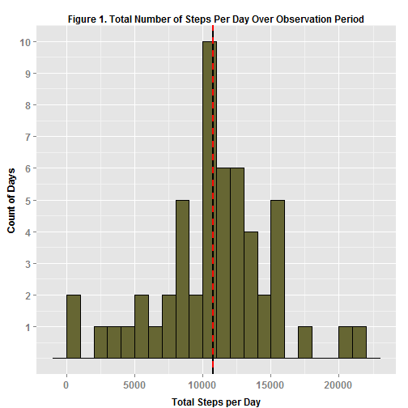
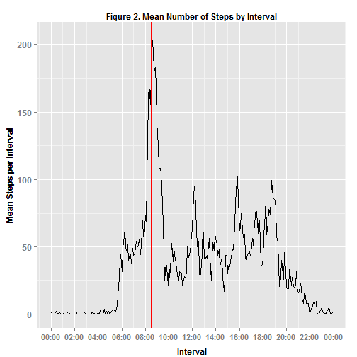
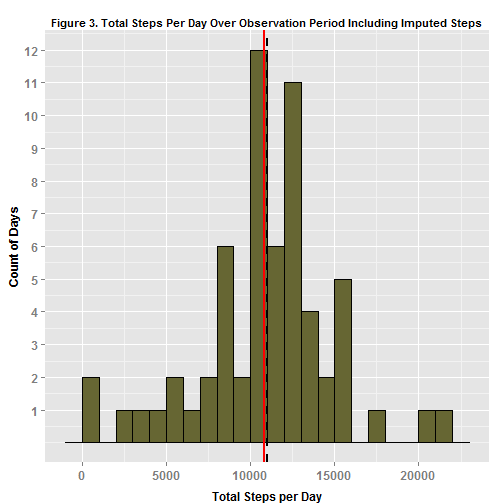
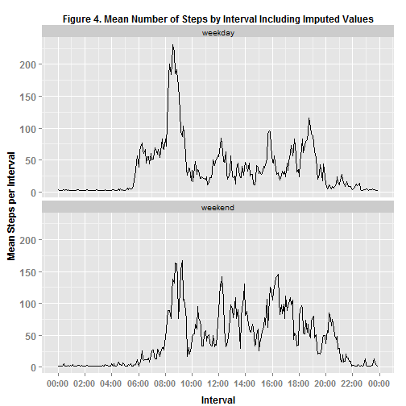

---
output:
  html_document:
    keep_md: true
---
# Reproducible Research: Peer Assessment 1

========================================

## Loading and preprocessing the data


```r
##I prefer to first tidy up the local environment by deleting all objects
rm(list=ls())
## Close graphics windows that might be open 
graphics.off()      

## Open a connection to the data on the website and download.
## THIS MAY TAKE A FEW sECONDS. PLEASE BE PATIENT.

url <- "http://d396qusza40orc.cloudfront.net/repdata%2Fdata%2Factivity.zip"
download.file(url, "repdata-data-activity.zip", mode="wb")
activity <- read.csv(unzip("repdata-data-activity.zip"), header=TRUE, stringsAsFactors=FALSE)

## Create a POSIXlt variable named date
date <- strptime(activity$date, "%Y-%m-%d") 
```

## What is mean total number of steps taken per day?

1. Calculate the total number of steps taken per day


```r
## use dplyr for aggregation
library(dplyr)

## Calculate the total number of steps taken per day
dayGrouped <- activity %>% group_by(date)
aggDataQ1 <- summarise(dayGrouped, totalSteps = sum(steps, na.rm =FALSE))
```

2. Make a histogram of the total number of steps taken each day


```r
#    Use ggplot2 to create the plot
library(ggplot2)

TSteps <- ggplot(aggDataQ1, aes(x = totalSteps))
TSteps + geom_histogram(binwidth = 1000, color = "black", fill="#666633" ) +
         labs(title = "Figure 1. Total Number of Steps Per Day Over Observation Period") +
         labs(x = "Total Steps per Day") + labs(y = "Count of Days") +
         geom_vline(aes(xintercept = mean(totalSteps, na.rm = T)), color = "red", linetype = "solid", size = 1) +
         geom_vline(aes(xintercept = median(totalSteps, na.rm = T)), color = "black", linetype = "dashed", size = 1) +
            theme(axis.title.x = element_text(face = "bold", size = 12),
            axis.text.x = element_text(face = "bold", size = 12),
            axis.title.y = element_text(face = "bold", size = 12),
            axis.text.y = element_text(face = "bold", size = 12)) +
            theme(axis.title.x = element_text(vjust = -0.5)) +
            theme(axis.title.y = element_text(vjust = 1)) +
            theme(plot.title = element_text(face = "bold", size = 12)) +
            scale_y_continuous(breaks = c(1:12))
```

 


3. Calculate and report the mean and median of the total number of steps taken per day
   

```r
# mean
round(mean(aggDataQ1$totalStep, na.rm =TRUE), digits = 2)
```

```
## [1] 10766.19
```

```r
# median
median(aggDataQ1$totalStep, na.rm = TRUE)
```

```
## [1] 10765
```

The mean is 10766.19 and the median is 10765.  These results are also shown in Figure 1 where the mean is shown as a solid red line and the median is shown as a dashed black line. Because the mean is very close to the median, these two lines appear to be on top of each other.

## What is the average daily activity pattern?

1. Make a time series plot (i.e. type = "l") of the 5-minute interval (x-axis) and the average number of steps taken, averaged across all days (y-axis)


```r
library(stringr) #Useful for working with strings
Sys.setenv(TZ='GMT')  #Set time to Greenwich Mean Time (which is basically the same as UTC)

# Aggregate (i.e., take the mean of) steps at the interval level
intervalGrouped <- activity %>% group_by(interval)
aggDataQ2 <- summarise(intervalGrouped, meanStep = mean(steps, na.rm = TRUE))

#Create an interval variable that is padded from the left to be 4 digits in length
aggDataQ2$intvPadded <- str_pad(aggDataQ2$interval, 4, pad="0")

#Insert a colon after the second digit and place in new variable called "wColon"
aggDataQ2$wColon <- gsub('^([0-9]{2})([0-9]+)$', '\\1:\\2', aggDataQ2$intvPadded)

#Concatenate date and time
aggDataQ2$date <-"2012-10-01"
aggDataQ2$dateUlt <- paste(aggDataQ2$date, aggDataQ2$wColon)

#Convert from character variable to POSIXct variable
aggDataQ2$dtPOSIXct <- as.POSIXct(aggDataQ2$dateUlt)

# extract time of POSIXct in hours as numeric value
aggDataQ2$dtTime <- as.numeric(aggDataQ2$dtPOSIXct - trunc(aggDataQ2$dtPOSIXct, "days"))

# Finally, convert dtTime to POSIXct variable. This gives a time interval variable ranging 
# from 00:00:00 to 23:55:00. This also appends 1970-01-01 at the front as the date, but since 
# we are only interesting in plotting interval as a proper time variable, the date is irrelevant
# and does no display on the graph.
class(aggDataQ2$dtTime) <- "POSIXct"

## Create actual plot
library(scales)  # package "scales" is useful for determining breaks and labels,
                 # necessary here to properly format the intervals on the x-axis

ggplot( data = aggDataQ2, aes(dtTime, meanStep )) + geom_line() +
    geom_vline(aes(xintercept = 30900), color = "red", linetype = "solid", size = 1) +
    labs(title = "Figure 2. Mean Number of Steps by Interval") +
    labs(x = "Interval") + labs(y = "Mean Steps per Interval") +
    theme(axis.title.x = element_text(face = "bold", size = 12),
          axis.text.x = element_text(face = "bold", size = 11),
          axis.title.y = element_text(face = "bold", size = 12),
          axis.text.y = element_text(face = "bold", size = 12)) +
    theme(axis.title.x = element_text(vjust = -0.5)) +
    theme(axis.title.y = element_text(vjust = 1)) +
    theme(plot.title = element_text(face = "bold", size = 12)) +
    scale_x_datetime(labels = date_format("%H:%M"),
                     breaks = date_breaks("2 hours")) #plots and labels dtTime (the interal variable)
```

 

```r
                                                      #as a proper time variable
```

2. Find the 5-minute interval containing the maximum average number of steps


```r
## First find maximum number of steps per interval
max(aggDataQ2$meanStep, na.rm = TRUE)
```

```
## [1] 206.1698
```

```r
# Find which interval contains the maximum average number of steps
aggDataQ2$dtTime[aggDataQ2$meanStep >= 206]
```

```
## [1] "1970-01-01 08:35:00 GMT"
```

```r
# The maximum average number of steps are in the interval 8:35
# Convert 8:35 to seconds and insert in the ggplot2 graph above where is is drawn as a red line
8*60*60 + 35*60
```

```
## [1] 30900
```

```r
# the interval in seconds is 30900
```

The maximum average number is steps is 206.17. The interval containing the maximum number of steps is 835 (i.e., 8:35 a.m.). This information is also shown in Figure 2 by the solid red line.

## Imputing missing values

1. Calculate and report the total number of missing values in the dataset (i.e. the total number of rows with NAs)


```r
sum(is.na(activity$steps))
```

```
## [1] 2304
```

The total number of missing values (all in the steps variable) is 2304.

2. Devise a strategy for filling in all of the missing values in the dataset. 

The strategy that I am going using to impute the missing data is to calculate the missing values by regressing steps on interval and day of week and plugging the missing steps with these predicted values. This is a simple additive regression model. First I will find all the factor levels with p < .05. Because the output from this regression analysis is rather lengthy, it is shown in the Appendix.


```r
## Run a preliminary regression
## create a variable for day of week
activity$dayofweek <- weekdays(date)

## convert interval to a factor
intervalFactor <- as.factor(activity$interval)

## run  actual regression
predSteps1 <- lm(steps ~ intervalFactor + dayofweek, data = activity)
```

Next I copied the interval variable into a new variable called intervalPlug and the dayofweek variable into a new variable called dayPlug. This leaves the original variables unchanged in case I need to use them later. I used the results of the regression above to find those factor levels that had p > 0.05 for both interval and day of week. I then recoded all of these levels with p > 0.05 to the reference factor level (i.e., interval = 5 and weekday = "Friday") in the new variables, which I used for the rest of the analyses. There are other ways to choose the best predictors such as using step wise methods but this way works too. Again, because the output of the regression procedure is rather lengthy, it is included in the Appendix.


```r
activity$intervalPlug <- activity$interval
activity$intervalPlug[activity$interval <= 550 | activity$interval >= 1955] <-5
activity$intervalPlug[activity$interval == 600] <-5
activity$intervalPlug[activity$interval == 635] <-5
activity$intervalPlug[activity$interval == 650] <-5
activity$intervalPlug[activity$interval >= 940 & activity$interval <= 1005] <-5
activity$intervalPlug[activity$interval == 1020] <-5
activity$intervalPlug[activity$interval >= 1035 & activity$interval <= 1130] <-5
activity$intervalPlug[activity$interval == 1140] <-5
activity$intervalPlug[activity$interval >= 1235 & activity$interval <= 1245] <-5
activity$intervalPlug[activity$interval == 1305] <-5
activity$intervalPlug[activity$interval == 1315] <-5
activity$intervalPlug[activity$interval == 1335] <-5
activity$intervalPlug[activity$interval == 1340] <-5
activity$intervalPlug[activity$interval >= 1420 & activity$interval <= 1445] <-5
activity$intervalPlug[activity$interval >= 1500 & activity$interval <= 1515] <-5
activity$intervalPlug[activity$interval == 1635] <-5
activity$intervalPlug[activity$interval >= 1750 & activity$interval <= 1800] <-5 
activity$intervalPlug[activity$interval >= 1920 & activity$interval <= 1945] <-5

# Recode intervalPlug into a factor variable
activity$intervalPlug <- as.factor(activity$intervalPlug)

# Copy dayofweek into a new variable and put nonsignificant day of week factor levels into reference level (Friday)
activity$dayPlug <- activity$dayofweek

activity$dayPlug[activity$dayofweek == "Saturday" |
                   activity$dayofweek == "Sunday" | 
                   activity$dayofweek == "Wednesday"] <- "Friday"

## Run the regression again and use the predicted values to plug the missing values
predSteps2 <- lm(steps ~ intervalPlug + dayPlug, data = activity)
```

3. Create a new dataset that is equal to the original dataset but with the missing data filled in.


```r
### create a new variable called stepsHat that contains the predicted values
activity$stepsHat <- round(predict(predSteps2, activity))

## Loop through data to replace the missing values

## First copy the steps variable into a new variable called stepsPlug that will have the missing values plugged with the predicted values (this leaves the original steps variable unchanged in case I want to use it again).
activity$stepsPlug <- activity$steps

## create logical variable called IsVarMiss to indicate whether steps are missing. The value of this variable will be TRUE if the value of step is missing and FALSE if the the step value is not missing.
IsVarMiss <- is.na(activity$steps) 

## Now do the actual looping through the length of the dataframe
i=0
for (i in seq_along(activity$steps)) {
    if (IsVarMiss[i] == TRUE)                           # Check if missing. If it is missing, 
        {activity$stepsPlug[i] <- activity$stepsHat[i]  # replace it with the predicted value.
        }
}

# Make sure that zero is the smallest value for stepsPlug
activity$stepsPlug[activity$stepsPlug < 0] <- 0
```

4. Make a histogram of the total number of steps per day across all days.
   

```r
## Aggregate the plugged data
dayGrouped <- activity %>% group_by(date)
aggDataQ3 <- summarise(dayGrouped, totalStepP = sum(stepsPlug, na.rm= FALSE))

## plot with imputed data
PSteps <- ggplot(aggDataQ3, aes(x = totalStepP))
PSteps + geom_histogram(binwidth = 1000, color = "black", fill = "#666633" ) +
    labs(title = "Figure 3. Total Steps Per Day Over Observation Period Including Imputed Steps") +
    labs(x = "Total Steps per Day") + labs(y = "Count of Days") +
    geom_vline(aes(xintercept = mean(totalStepP, na.rm = T)), color = "red", linetype = "solid", size = 1) +
    geom_vline(aes(xintercept = median(totalStepP, na.rm = T)), color = "black", linetype = "dashed", size = 1) +
    theme(axis.title.x = element_text(face = "bold", size = 12),
          axis.text.x = element_text(face = "bold", size=12),
          axis.title.y = element_text(face="bold", size=12),
          axis.text.y = element_text(face="bold", size=12)) +
    theme(axis.title.x = element_text(vjust = -0.5)) +
    theme(axis.title.y = element_text(vjust = 1)) +
    theme(plot.title = element_text(face = "bold", size = 11)) +
    scale_y_continuous(breaks = c(1:12))
```

 

Calculate and report the mean and median total number of steps taken per day.


```r
mean(aggDataQ3$totalStepP)
```

```
## [1] 10824.52
```

```r
median(aggDataQ3$totalStepP)
```

```
## [1] 11015
```

Using the imputed data, the mean increased to 10824.52 and the median increased to 11015. These results are also shown in Figure 3 where the mean is shown as a solid red line and the median is shown as a dashed black line. These are not huge differences from these statistics calculated on the original data and are mainly due to new steps per day around the original mean.

## Are there differences in activity patterns between weekdays and weekends?

1. Create a new factor variable in the dataset with two levels - "weekday" and "weekend" indicating whether a given date is a weekday or weekend day.


```r
## Create weekend variable
dayofweek <- weekdays(date)
weekend <- is.character("weekday")
weekend[dayofweek != "Saturday" & dayofweek != "Sunday"] <- "weekday"
weekend[dayofweek == "Saturday" | dayofweek == "Sunday"] <- "weekend"
activity$weekend <- as.factor(weekend)
```

2. Make a panel plot containing a time series plot (i.e. type = "l") of the 5-minute interval (x-axis) and the average number of steps taken, averaged across all weekday days or weekend days (y-axis). 


```r
##First aggegrate the plugged steps (i.e., including imputed values)by interval and weekend (weekday vs weekend)

intervalGrouped <- activity %>% group_by(interval, weekend)
aggDataQ4 <- summarise(intervalGrouped, meanStepP = mean(stepsPlug))

# Pull out the inverval variable and the dtTime (interval converted to date format) from the earlier aggregation
aggDataQ2Intvl <- subset(aggDataQ2, select = c(interval, dtTime))

# append dtTime to the records created in aggDataQ4 by merging on "interval"
aggDataQ4Intvl <- merge(aggDataQ4, aggDataQ2Intvl, by = "interval")

## Make the final plot using facets to create two plots, one for weedays and one for weekends, in one column
ggplot(aggDataQ4Intvl, aes(dtTime, meanStepP)) + geom_line() +
    labs(title = "Figure 4. Mean Number of Steps by Interval Including Imputed Values") +
    labs(x = "Interval") + labs(y = "Mean Steps per Interval") +
    theme(axis.title.x = element_text(face = "bold", size = 12),
          axis.text.x = element_text(face = "bold", size = 11),
          axis.title.y = element_text(face = "bold", size = 12),
          axis.text.y = element_text(face = "bold", size = 12)) +
    theme(axis.title.x = element_text(vjust = -0.5)) +
    theme(axis.title.y = element_text(vjust = 1)) +
    theme(plot.title = element_text(face = "bold", size = 12)) +
    scale_x_datetime(labels = date_format("%H:%M"), breaks = date_breaks("2 hours")) +
    facet_wrap( ~ weekend, ncol = 1)
```

 

There appears to be more activity in the morning on weekdays than on weekends and conversely there is more activity later in the day and night on weekends than on weekdays. 

Additional considerations for doing a thorough analysis are discussed at the end of the Appendix.

The End.

## Appendix


```r
## Original regression analysis
predSteps1 <- lm(steps ~ intervalFactor + dayofweek, data = activity)
summary(predSteps1)
```

```
## 
## Call:
## lm(formula = steps ~ intervalFactor + dayofweek, data = activity)
## 
## Residuals:
##     Min      1Q  Median      3Q     Max 
## -212.31  -41.82  -12.19    2.75  760.85 
## 
## Coefficients:
##                     Estimate Std. Error t value Pr(>|t|)    
## (Intercept)          7.25006   14.72450   0.492 0.622458    
## intervalFactor5     -1.37736   20.59001  -0.067 0.946667    
## intervalFactor10    -1.58491   20.59001  -0.077 0.938645    
## intervalFactor15    -1.56604   20.59001  -0.076 0.939374    
## intervalFactor20    -1.64151   20.59001  -0.080 0.936458    
## intervalFactor25     0.37736   20.59001   0.018 0.985378    
## intervalFactor30    -1.18868   20.59001  -0.058 0.953964    
## intervalFactor35    -0.84906   20.59001  -0.041 0.967108    
## intervalFactor40    -1.71698   20.59001  -0.083 0.933543    
## intervalFactor45    -0.24528   20.59001  -0.012 0.990495    
## intervalFactor50    -1.41509   20.59001  -0.069 0.945208    
## intervalFactor55    -1.58491   20.59001  -0.077 0.938645    
## intervalFactor100   -1.39623   20.59001  -0.068 0.945937    
## intervalFactor105   -1.03774   20.59001  -0.050 0.959804    
## intervalFactor110   -1.56604   20.59001  -0.076 0.939374    
## intervalFactor115   -1.37736   20.59001  -0.067 0.946667    
## intervalFactor120   -1.71698   20.59001  -0.083 0.933543    
## intervalFactor125   -0.60377   20.59001  -0.029 0.976607    
## intervalFactor130    0.11321   20.59001   0.005 0.995613    
## intervalFactor135   -1.54717   20.59001  -0.075 0.940103    
## intervalFactor140   -1.54717   20.59001  -0.075 0.940103    
## intervalFactor145   -1.33962   20.59001  -0.065 0.948126    
## intervalFactor150   -1.45283   20.59001  -0.071 0.943749    
## intervalFactor155   -1.71698   20.59001  -0.083 0.933543    
## intervalFactor200   -1.71698   20.59001  -0.083 0.933543    
## intervalFactor205   -1.71698   20.59001  -0.083 0.933543    
## intervalFactor210   -0.58491   20.59001  -0.028 0.977338    
## intervalFactor215   -1.71698   20.59001  -0.083 0.933543    
## intervalFactor220   -1.71698   20.59001  -0.083 0.933543    
## intervalFactor225   -1.58491   20.59001  -0.077 0.938645    
## intervalFactor230   -1.71698   20.59001  -0.083 0.933543    
## intervalFactor235   -1.49057   20.59001  -0.072 0.942290    
## intervalFactor240   -1.71698   20.59001  -0.083 0.933543    
## intervalFactor245   -1.71698   20.59001  -0.083 0.933543    
## intervalFactor250   -0.16981   20.59001  -0.008 0.993420    
## intervalFactor255   -0.77358   20.59001  -0.038 0.970030    
## intervalFactor300   -1.71698   20.59001  -0.083 0.933543    
## intervalFactor305   -1.71698   20.59001  -0.083 0.933543    
## intervalFactor310   -1.71698   20.59001  -0.083 0.933543    
## intervalFactor315   -1.71698   20.59001  -0.083 0.933543    
## intervalFactor320   -1.50943   20.59001  -0.073 0.941561    
## intervalFactor325   -1.09434   20.59001  -0.053 0.957614    
## intervalFactor330   -0.09434   20.59001  -0.005 0.996344    
## intervalFactor335   -1.13208   20.59001  -0.055 0.956154    
## intervalFactor340   -1.22642   20.59001  -0.060 0.952504    
## intervalFactor345   -1.64151   20.59001  -0.080 0.936458    
## intervalFactor350   -1.71698   20.59001  -0.083 0.933543    
## intervalFactor355   -1.71698   20.59001  -0.083 0.933543    
## intervalFactor400   -0.52830   20.59001  -0.026 0.979530    
## intervalFactor405   -0.77358   20.59001  -0.038 0.970030    
## intervalFactor410    0.84906   20.59001   0.041 0.967108    
## intervalFactor415   -1.71698   20.59001  -0.083 0.933543    
## intervalFactor420   -1.37736   20.59001  -0.067 0.946667    
## intervalFactor425   -1.35849   20.59001  -0.066 0.947396    
## intervalFactor430    2.39623   20.59001   0.116 0.907354    
## intervalFactor435   -1.05660   20.59001  -0.051 0.959074    
## intervalFactor440    1.77358   20.59001   0.086 0.931358    
## intervalFactor445   -0.88679   20.59001  -0.043 0.965647    
## intervalFactor450    1.39623   20.59001   0.068 0.945937    
## intervalFactor455   -0.60377   20.59001  -0.029 0.976607    
## intervalFactor500   -1.71698   20.59001  -0.083 0.933543    
## intervalFactor505   -0.15094   20.59001  -0.007 0.994151    
## intervalFactor510    1.28302   20.59001   0.062 0.950315    
## intervalFactor515    0.52830   20.59001   0.026 0.979530    
## intervalFactor520    1.60377   20.59001   0.078 0.937916    
## intervalFactor525    1.24528   20.59001   0.060 0.951774    
## intervalFactor530    0.37736   20.59001   0.018 0.985378    
## intervalFactor535    4.33962   20.59001   0.211 0.833075    
## intervalFactor540   14.30189   20.59001   0.695 0.487315    
## intervalFactor545   16.62264   20.59001   0.807 0.419497    
## intervalFactor550   37.73585   20.59001   1.833 0.066863 .  
## intervalFactor555   42.77358   20.59001   2.077 0.037782 *  
## intervalFactor600   29.77358   20.59001   1.446 0.148192    
## intervalFactor605   47.54717   20.59001   2.309 0.020944 *  
## intervalFactor610   52.05660   20.59001   2.528 0.011474 *  
## intervalFactor615   61.73585   20.59001   2.998 0.002719 ** 
## intervalFactor620   48.24528   20.59001   2.343 0.019135 *  
## intervalFactor625   45.35849   20.59001   2.203 0.027614 *  
## intervalFactor630   50.43396   20.59001   2.449 0.014319 *  
## intervalFactor635   37.62264   20.59001   1.827 0.067685 .  
## intervalFactor640   42.30189   20.59001   2.054 0.039946 *  
## intervalFactor645   42.45283   20.59001   2.062 0.039242 *  
## intervalFactor650   35.64151   20.59001   1.731 0.083471 .  
## intervalFactor655   47.32075   20.59001   2.298 0.021562 *  
## intervalFactor700   42.09434   20.59001   2.044 0.040931 *  
## intervalFactor705   42.66038   20.59001   2.072 0.038292 *  
## intervalFactor710   48.79245   20.59001   2.370 0.017814 *  
## intervalFactor715   52.79245   20.59001   2.564 0.010357 *  
## intervalFactor720   48.20755   20.59001   2.341 0.019229 *  
## intervalFactor725   49.26415   20.59001   2.393 0.016741 *  
## intervalFactor730   53.96226   20.59001   2.621 0.008781 ** 
## intervalFactor735   42.60377   20.59001   2.069 0.038549 *  
## intervalFactor740   50.54717   20.59001   2.455 0.014102 *  
## intervalFactor745   67.83019   20.59001   3.294 0.000989 ***
## intervalFactor750   56.13208   20.59001   2.726 0.006415 ** 
## intervalFactor755   54.43396   20.59001   2.644 0.008209 ** 
## intervalFactor800   71.66038   20.59001   3.480 0.000502 ***
## intervalFactor805   66.49057   20.59001   3.229 0.001244 ** 
## intervalFactor810  127.71698   20.59001   6.203 5.69e-10 ***
## intervalFactor815  155.81132   20.59001   7.567 4.03e-14 ***
## intervalFactor820  169.43396   20.59001   8.229  < 2e-16 ***
## intervalFactor825  153.67925   20.59001   7.464 8.87e-14 ***
## intervalFactor830  175.58491   20.59001   8.528  < 2e-16 ***
## intervalFactor835  204.45283   20.59001   9.930  < 2e-16 ***
## intervalFactor840  194.20755   20.59001   9.432  < 2e-16 ***
## intervalFactor845  177.84906   20.59001   8.638  < 2e-16 ***
## intervalFactor850  181.67925   20.59001   8.824  < 2e-16 ***
## intervalFactor855  165.30189   20.59001   8.028 1.06e-15 ***
## intervalFactor900  141.73585   20.59001   6.884 6.06e-12 ***
## intervalFactor905  122.32075   20.59001   5.941 2.90e-09 ***
## intervalFactor910  107.39623   20.59001   5.216 1.85e-07 ***
## intervalFactor915  106.39623   20.59001   5.167 2.40e-07 ***
## intervalFactor920  102.00000   20.59001   4.954 7.35e-07 ***
## intervalFactor925   94.24528   20.59001   4.577 4.75e-06 ***
## intervalFactor930   64.49057   20.59001   3.132 0.001739 ** 
## intervalFactor935   43.50943   20.59001   2.113 0.034606 *  
## intervalFactor940   23.07547   20.59001   1.121 0.262428    
## intervalFactor945   37.03774   20.59001   1.799 0.072067 .  
## intervalFactor950   33.26415   20.59001   1.616 0.106213    
## intervalFactor955   19.33962   20.59001   0.939 0.347606    
## intervalFactor1000  38.84906   20.59001   1.887 0.059208 .  
## intervalFactor1005  25.26415   20.59001   1.227 0.219838    
## intervalFactor1010  40.69811   20.59001   1.977 0.048106 *  
## intervalFactor1015  50.94340   20.59001   2.474 0.013365 *  
## intervalFactor1020  37.20755   20.59001   1.807 0.070772 .  
## intervalFactor1025  49.07547   20.59001   2.383 0.017163 *  
## intervalFactor1030  42.56604   20.59001   2.067 0.038722 *  
## intervalFactor1035  35.69811   20.59001   1.734 0.082981 .  
## intervalFactor1040  32.98113   20.59001   1.602 0.109220    
## intervalFactor1045  26.62264   20.59001   1.293 0.196035    
## intervalFactor1050  23.37736   20.59001   1.135 0.256237    
## intervalFactor1055  30.22642   20.59001   1.468 0.142121    
## intervalFactor1100  29.64151   20.59001   1.440 0.150000    
## intervalFactor1105  27.96226   20.59001   1.358 0.174468    
## intervalFactor1110  19.60377   20.59001   0.952 0.341061    
## intervalFactor1115  23.83019   20.59001   1.157 0.247141    
## intervalFactor1120  26.66038   20.59001   1.295 0.195402    
## intervalFactor1125  24.75472   20.59001   1.202 0.229279    
## intervalFactor1130  31.71698   20.59001   1.540 0.123482    
## intervalFactor1135  48.26415   20.59001   2.344 0.019088 *  
## intervalFactor1140  40.32075   20.59001   1.958 0.050217 .  
## intervalFactor1145  42.88679   20.59001   2.083 0.037278 *  
## intervalFactor1150  44.32075   20.59001   2.153 0.031371 *  
## intervalFactor1155  57.47170   20.59001   2.791 0.005257 ** 
## intervalFactor1200  62.15094   20.59001   3.019 0.002545 ** 
## intervalFactor1205  85.98113   20.59001   4.176 2.99e-05 ***
## intervalFactor1210  93.13208   20.59001   4.523 6.14e-06 ***
## intervalFactor1215  91.05660   20.59001   4.422 9.83e-06 ***
## intervalFactor1220  61.67925   20.59001   2.996 0.002744 ** 
## intervalFactor1225  48.45283   20.59001   2.353 0.018624 *  
## intervalFactor1230  52.75472   20.59001   2.562 0.010412 *  
## intervalFactor1235  30.69811   20.59001   1.491 0.136003    
## intervalFactor1240  24.81132   20.59001   1.205 0.228216    
## intervalFactor1245  36.01887   20.59001   1.749 0.080253 .  
## intervalFactor1250  43.33962   20.59001   2.105 0.035318 *  
## intervalFactor1255  65.56604   20.59001   3.184 0.001454 ** 
## intervalFactor1300  40.62264   20.59001   1.973 0.048522 *  
## intervalFactor1305  38.16981   20.59001   1.854 0.063787 .  
## intervalFactor1310  41.54717   20.59001   2.018 0.043627 *  
## intervalFactor1315  39.26415   20.59001   1.907 0.056546 .  
## intervalFactor1320  44.52830   20.59001   2.163 0.030586 *  
## intervalFactor1325  54.71698   20.59001   2.657 0.007882 ** 
## intervalFactor1330  41.03774   20.59001   1.993 0.046270 *  
## intervalFactor1335  23.41509   20.59001   1.137 0.255470    
## intervalFactor1340  38.24528   20.59001   1.857 0.063264 .  
## intervalFactor1345  51.83019   20.59001   2.517 0.011838 *  
## intervalFactor1350  45.60377   20.59001   2.215 0.026785 *  
## intervalFactor1355  59.09434   20.59001   2.870 0.004110 ** 
## intervalFactor1400  54.03774   20.59001   2.624 0.008687 ** 
## intervalFactor1405  50.24528   20.59001   2.440 0.014688 *  
## intervalFactor1410  41.86792   20.59001   2.033 0.042029 *  
## intervalFactor1415  46.98113   20.59001   2.282 0.022518 *  
## intervalFactor1420  33.75472   20.59001   1.639 0.101156    
## intervalFactor1425  35.83019   20.59001   1.740 0.081849 .  
## intervalFactor1430  40.13208   20.59001   1.949 0.051302 .  
## intervalFactor1435  25.79245   20.59001   1.253 0.210346    
## intervalFactor1440  15.39623   20.59001   0.748 0.454621    
## intervalFactor1445  24.35849   20.59001   1.183 0.236818    
## intervalFactor1450  41.90566   20.59001   2.035 0.041844 *  
## intervalFactor1455  42.05660   20.59001   2.043 0.041112 *  
## intervalFactor1500  28.30189   20.59001   1.375 0.169293    
## intervalFactor1505  34.35849   20.59001   1.669 0.095198 .  
## intervalFactor1510  33.77358   20.59001   1.640 0.100966    
## intervalFactor1515  37.13208   20.59001   1.803 0.071345 .  
## intervalFactor1520  44.24528   20.59001   2.149 0.031661 *  
## intervalFactor1525  46.03774   20.59001   2.236 0.025371 *  
## intervalFactor1530  46.41509   20.59001   2.254 0.024195 *  
## intervalFactor1535  63.60377   20.59001   3.089 0.002012 ** 
## intervalFactor1540  81.18868   20.59001   3.943 8.08e-05 ***
## intervalFactor1545  96.94340   20.59001   4.708 2.52e-06 ***
## intervalFactor1550 100.39623   20.59001   4.876 1.09e-06 ***
## intervalFactor1555  82.24528   20.59001   3.994 6.52e-05 ***
## intervalFactor1600  60.41509   20.59001   2.934 0.003349 ** 
## intervalFactor1605  62.41509   20.59001   3.031 0.002439 ** 
## intervalFactor1610  72.83019   20.59001   3.537 0.000406 ***
## intervalFactor1615  61.45283   20.59001   2.985 0.002844 ** 
## intervalFactor1620  55.18868   20.59001   2.680 0.007362 ** 
## intervalFactor1625  58.05660   20.59001   2.820 0.004814 ** 
## intervalFactor1630  42.15094   20.59001   2.047 0.040660 *  
## intervalFactor1635  36.84906   20.59001   1.790 0.073529 .  
## intervalFactor1640  42.94340   20.59001   2.086 0.037028 *  
## intervalFactor1645  43.73585   20.59001   2.124 0.033676 *  
## intervalFactor1650  44.49057   20.59001   2.161 0.030728 *  
## intervalFactor1655  41.96226   20.59001   2.038 0.041568 *  
## intervalFactor1700  44.90566   20.59001   2.181 0.029203 *  
## intervalFactor1705  54.58491   20.59001   2.651 0.008033 ** 
## intervalFactor1710  49.00000   20.59001   2.380 0.017335 *  
## intervalFactor1715  59.50943   20.59001   2.890 0.003855 ** 
## intervalFactor1720  71.00000   20.59001   3.448 0.000566 ***
## intervalFactor1725  77.22642   20.59001   3.751 0.000177 ***
## intervalFactor1730  67.22642   20.59001   3.265 0.001097 ** 
## intervalFactor1735  57.94340   20.59001   2.814 0.004897 ** 
## intervalFactor1740  73.37736   20.59001   3.564 0.000367 ***
## intervalFactor1745  54.79245   20.59001   2.661 0.007796 ** 
## intervalFactor1750  33.05660   20.59001   1.605 0.108412    
## intervalFactor1755  35.73585   20.59001   1.736 0.082657 .  
## intervalFactor1800  38.96226   20.59001   1.892 0.058472 .  
## intervalFactor1805  56.30189   20.59001   2.734 0.006256 ** 
## intervalFactor1810  72.98113   20.59001   3.544 0.000395 ***
## intervalFactor1815  83.60377   20.59001   4.060 4.92e-05 ***
## intervalFactor1820  57.54717   20.59001   2.795 0.005198 ** 
## intervalFactor1825  66.05660   20.59001   3.208 0.001339 ** 
## intervalFactor1830  75.98113   20.59001   3.690 0.000225 ***
## intervalFactor1835  72.52830   20.59001   3.523 0.000429 ***
## intervalFactor1840  83.62264   20.59001   4.061 4.90e-05 ***
## intervalFactor1845  97.73585   20.59001   4.747 2.09e-06 ***
## intervalFactor1850  84.86792   20.59001   4.122 3.78e-05 ***
## intervalFactor1855  83.88679   20.59001   4.074 4.64e-05 ***
## intervalFactor1900  83.15094   20.59001   4.038 5.41e-05 ***
## intervalFactor1905  76.11321   20.59001   3.697 0.000219 ***
## intervalFactor1910  56.32075   20.59001   2.735 0.006239 ** 
## intervalFactor1915  51.64151   20.59001   2.508 0.012149 *  
## intervalFactor1920  34.60377   20.59001   1.681 0.092860 .  
## intervalFactor1925  19.00000   20.59001   0.923 0.356138    
## intervalFactor1930  25.67925   20.59001   1.247 0.212355    
## intervalFactor1935  38.30189   20.59001   1.860 0.062874 .  
## intervalFactor1940  28.49057   20.59001   1.384 0.166468    
## intervalFactor1945  23.83019   20.59001   1.157 0.247141    
## intervalFactor1950  43.94340   20.59001   2.134 0.032842 *  
## intervalFactor1955  31.81132   20.59001   1.545 0.122370    
## intervalFactor2000  17.90566   20.59001   0.870 0.384517    
## intervalFactor2005  17.30189   20.59001   0.840 0.400751    
## intervalFactor2010  17.62264   20.59001   0.856 0.392076    
## intervalFactor2015  31.62264   20.59001   1.536 0.124603    
## intervalFactor2020  25.09434   20.59001   1.219 0.222953    
## intervalFactor2025  19.45283   20.59001   0.945 0.344791    
## intervalFactor2030  25.58491   20.59001   1.243 0.214039    
## intervalFactor2035  19.62264   20.59001   0.953 0.340596    
## intervalFactor2040  17.83019   20.59001   0.866 0.386524    
## intervalFactor2045  19.60377   20.59001   0.952 0.341061    
## intervalFactor2050  30.58491   20.59001   1.485 0.137452    
## intervalFactor2055  18.43396   20.59001   0.895 0.370648    
## intervalFactor2100  14.22642   20.59001   0.691 0.489615    
## intervalFactor2105  15.50943   20.59001   0.753 0.451311    
## intervalFactor2110  21.73585   20.59001   1.056 0.291145    
## intervalFactor2115  17.52830   20.59001   0.851 0.394616    
## intervalFactor2120  10.73585   20.59001   0.521 0.602088    
## intervalFactor2125   6.30189   20.59001   0.306 0.759559    
## intervalFactor2130  12.94340   20.59001   0.629 0.529604    
## intervalFactor2135  14.58491   20.59001   0.708 0.478740    
## intervalFactor2140   6.96226   20.59001   0.338 0.735264    
## intervalFactor2145   6.07547   20.59001   0.295 0.767945    
## intervalFactor2150   6.41509   20.59001   0.312 0.755377    
## intervalFactor2155   0.90566   20.59001   0.044 0.964917    
## intervalFactor2200  -0.26415   20.59001  -0.013 0.989764    
## intervalFactor2205   1.96226   20.59001   0.095 0.924076    
## intervalFactor2210   3.09434   20.59001   0.150 0.880543    
## intervalFactor2215   6.79245   20.59001   0.330 0.741487    
## intervalFactor2220   5.35849   20.59001   0.260 0.794677    
## intervalFactor2225   6.98113   20.59001   0.339 0.734574    
## intervalFactor2230   8.03774   20.59001   0.390 0.696268    
## intervalFactor2235   0.49057   20.59001   0.024 0.980992    
## intervalFactor2240  -1.39623   20.59001  -0.068 0.945937    
## intervalFactor2245  -1.60377   20.59001  -0.078 0.937916    
## intervalFactor2250  -0.11321   20.59001  -0.005 0.995613    
## intervalFactor2255   2.88679   20.59001   0.140 0.888501    
## intervalFactor2300   1.58491   20.59001   0.077 0.938645    
## intervalFactor2305   1.13208   20.59001   0.055 0.956154    
## intervalFactor2310  -1.71698   20.59001  -0.083 0.933543    
## intervalFactor2315  -0.88679   20.59001  -0.043 0.965647    
## intervalFactor2320  -0.75472   20.59001  -0.037 0.970761    
## intervalFactor2325  -0.13208   20.59001  -0.006 0.994882    
## intervalFactor2330   0.88679   20.59001   0.043 0.965647    
## intervalFactor2335   2.98113   20.59001   0.145 0.884882    
## intervalFactor2340   1.58491   20.59001   0.077 0.938645    
## intervalFactor2345  -1.07547   20.59001  -0.052 0.958344    
## intervalFactor2350  -1.49057   20.59001  -0.072 0.942290    
## intervalFactor2355  -0.64151   20.59001  -0.031 0.975145    
## dayofweekMonday     -8.28075    3.33848  -2.480 0.013135 *  
## dayofweekSaturday    0.61012    3.33848   0.183 0.854994    
## dayofweekSunday     -0.28472    3.33848  -0.085 0.932036    
## dayofweekThursday  -14.39918    3.23247  -4.455 8.47e-06 ***
## dayofweekTuesday   -11.84083    3.14755  -3.762 0.000169 ***
## dayofweekWednesday  -1.97557    3.23247  -0.611 0.541100    
## ---
## Signif. codes:  0 '***' 0.001 '**' 0.01 '*' 0.05 '.' 0.1 ' ' 1
## 
## Residual standard error: 106 on 14970 degrees of freedom
##   (2304 observations deleted due to missingness)
## Multiple R-squared:  0.1215,	Adjusted R-squared:  0.1043 
## F-statistic: 7.067 on 293 and 14970 DF,  p-value: < 2.2e-16
```

```r
## Regression analysis with recoded interval and day of week variables
predSteps2 <- lm(steps ~ intervalPlug + dayPlug, data = activity)
summary(predSteps2)
```

```
## 
## Call:
## lm(formula = steps ~ intervalPlug + dayPlug, data = activity)
## 
## Residuals:
##     Min      1Q  Median      3Q     Max 
## -211.24  -38.18  -18.65   -4.72  786.72 
## 
## Coefficients:
##                  Estimate Std. Error t value Pr(>|t|)    
## (Intercept)        18.650      1.363  13.688  < 2e-16 ***
## intervalPlug555    30.908     14.604   2.116 0.034324 *  
## intervalPlug605    35.681     14.604   2.443 0.014565 *  
## intervalPlug610    40.191     14.604   2.752 0.005929 ** 
## intervalPlug615    49.870     14.604   3.415 0.000640 ***
## intervalPlug620    36.379     14.604   2.491 0.012745 *  
## intervalPlug625    33.493     14.604   2.293 0.021837 *  
## intervalPlug630    38.568     14.604   2.641 0.008275 ** 
## intervalPlug640    30.436     14.604   2.084 0.037165 *  
## intervalPlug645    30.587     14.604   2.094 0.036235 *  
## intervalPlug655    35.455     14.604   2.428 0.015202 *  
## intervalPlug700    30.228     14.604   2.070 0.038477 *  
## intervalPlug705    30.794     14.604   2.109 0.034989 *  
## intervalPlug710    36.927     14.604   2.529 0.011463 *  
## intervalPlug715    40.927     14.604   2.802 0.005078 ** 
## intervalPlug720    36.342     14.604   2.489 0.012838 *  
## intervalPlug725    37.398     14.604   2.561 0.010450 *  
## intervalPlug730    42.096     14.604   2.883 0.003950 ** 
## intervalPlug735    30.738     14.604   2.105 0.035325 *  
## intervalPlug740    38.681     14.604   2.649 0.008088 ** 
## intervalPlug745    55.964     14.604   3.832 0.000128 ***
## intervalPlug750    44.266     14.604   3.031 0.002440 ** 
## intervalPlug755    42.568     14.604   2.915 0.003563 ** 
## intervalPlug800    59.794     14.604   4.094 4.25e-05 ***
## intervalPlug805    54.625     14.604   3.740 0.000184 ***
## intervalPlug810   115.851     14.604   7.933 2.29e-15 ***
## intervalPlug815   143.945     14.604   9.857  < 2e-16 ***
## intervalPlug820   157.568     14.604  10.790  < 2e-16 ***
## intervalPlug825   141.813     14.604   9.711  < 2e-16 ***
## intervalPlug830   163.719     14.604  11.211  < 2e-16 ***
## intervalPlug835   192.587     14.604  13.188  < 2e-16 ***
## intervalPlug840   182.342     14.604  12.486  < 2e-16 ***
## intervalPlug845   165.983     14.604  11.366  < 2e-16 ***
## intervalPlug850   169.813     14.604  11.628  < 2e-16 ***
## intervalPlug855   153.436     14.604  10.507  < 2e-16 ***
## intervalPlug900   129.870     14.604   8.893  < 2e-16 ***
## intervalPlug905   110.455     14.604   7.564 4.15e-14 ***
## intervalPlug910    95.530     14.604   6.542 6.28e-11 ***
## intervalPlug915    94.530     14.604   6.473 9.90e-11 ***
## intervalPlug920    90.134     14.604   6.172 6.91e-10 ***
## intervalPlug925    82.379     14.604   5.641 1.72e-08 ***
## intervalPlug930    52.625     14.604   3.604 0.000315 ***
## intervalPlug935    31.644     14.604   2.167 0.030264 *  
## intervalPlug1010   28.832     14.604   1.974 0.048364 *  
## intervalPlug1015   39.077     14.604   2.676 0.007462 ** 
## intervalPlug1025   37.210     14.604   2.548 0.010845 *  
## intervalPlug1030   30.700     14.604   2.102 0.035551 *  
## intervalPlug1135   36.398     14.604   2.492 0.012699 *  
## intervalPlug1145   31.021     14.604   2.124 0.033671 *  
## intervalPlug1150   32.455     14.604   2.222 0.026273 *  
## intervalPlug1155   45.606     14.604   3.123 0.001794 ** 
## intervalPlug1200   50.285     14.604   3.443 0.000576 ***
## intervalPlug1205   74.115     14.604   5.075 3.92e-07 ***
## intervalPlug1210   81.266     14.604   5.565 2.67e-08 ***
## intervalPlug1215   79.191     14.604   5.423 5.96e-08 ***
## intervalPlug1220   49.813     14.604   3.411 0.000649 ***
## intervalPlug1225   36.587     14.604   2.505 0.012244 *  
## intervalPlug1230   40.889     14.604   2.800 0.005118 ** 
## intervalPlug1250   31.474     14.604   2.155 0.031163 *  
## intervalPlug1255   53.700     14.604   3.677 0.000237 ***
## intervalPlug1300   28.757     14.604   1.969 0.048955 *  
## intervalPlug1310   29.681     14.604   2.032 0.042125 *  
## intervalPlug1320   32.662     14.604   2.237 0.025328 *  
## intervalPlug1325   42.851     14.604   2.934 0.003348 ** 
## intervalPlug1330   29.172     14.604   1.998 0.045781 *  
## intervalPlug1345   39.964     14.604   2.737 0.006215 ** 
## intervalPlug1350   33.738     14.604   2.310 0.020889 *  
## intervalPlug1355   47.228     14.604   3.234 0.001223 ** 
## intervalPlug1400   42.172     14.604   2.888 0.003886 ** 
## intervalPlug1405   38.379     14.604   2.628 0.008596 ** 
## intervalPlug1410   30.002     14.604   2.054 0.039953 *  
## intervalPlug1415   35.115     14.604   2.405 0.016204 *  
## intervalPlug1450   30.040     14.604   2.057 0.039703 *  
## intervalPlug1455   30.191     14.604   2.067 0.038719 *  
## intervalPlug1520   32.379     14.604   2.217 0.026624 *  
## intervalPlug1525   34.172     14.604   2.340 0.019299 *  
## intervalPlug1530   34.549     14.604   2.366 0.018004 *  
## intervalPlug1535   51.738     14.604   3.543 0.000397 ***
## intervalPlug1540   69.323     14.604   4.747 2.08e-06 ***
## intervalPlug1545   85.077     14.604   5.826 5.80e-09 ***
## intervalPlug1550   88.530     14.604   6.062 1.37e-09 ***
## intervalPlug1555   70.379     14.604   4.819 1.45e-06 ***
## intervalPlug1600   48.549     14.604   3.324 0.000888 ***
## intervalPlug1605   50.549     14.604   3.461 0.000539 ***
## intervalPlug1610   60.964     14.604   4.175 3.00e-05 ***
## intervalPlug1615   49.587     14.604   3.396 0.000687 ***
## intervalPlug1620   43.323     14.604   2.967 0.003016 ** 
## intervalPlug1625   46.191     14.604   3.163 0.001565 ** 
## intervalPlug1630   30.285     14.604   2.074 0.038115 *  
## intervalPlug1640   31.077     14.604   2.128 0.033348 *  
## intervalPlug1645   31.870     14.604   2.182 0.029101 *  
## intervalPlug1650   32.625     14.604   2.234 0.025497 *  
## intervalPlug1655   30.096     14.604   2.061 0.039332 *  
## intervalPlug1700   33.040     14.604   2.262 0.023685 *  
## intervalPlug1705   42.719     14.604   2.925 0.003447 ** 
## intervalPlug1710   37.134     14.604   2.543 0.011007 *  
## intervalPlug1715   47.644     14.604   3.262 0.001107 ** 
## intervalPlug1720   59.134     14.604   4.049 5.16e-05 ***
## intervalPlug1725   65.360     14.604   4.476 7.67e-06 ***
## intervalPlug1730   55.360     14.604   3.791 0.000151 ***
## intervalPlug1735   46.077     14.604   3.155 0.001607 ** 
## intervalPlug1740   61.511     14.604   4.212 2.55e-05 ***
## intervalPlug1745   42.927     14.604   2.939 0.003293 ** 
## intervalPlug1805   44.436     14.604   3.043 0.002348 ** 
## intervalPlug1810   61.115     14.604   4.185 2.87e-05 ***
## intervalPlug1815   71.738     14.604   4.912 9.09e-07 ***
## intervalPlug1820   45.681     14.604   3.128 0.001763 ** 
## intervalPlug1825   54.191     14.604   3.711 0.000207 ***
## intervalPlug1830   64.115     14.604   4.390 1.14e-05 ***
## intervalPlug1835   60.662     14.604   4.154 3.29e-05 ***
## intervalPlug1840   71.757     14.604   4.914 9.03e-07 ***
## intervalPlug1845   85.870     14.604   5.880 4.19e-09 ***
## intervalPlug1850   73.002     14.604   4.999 5.83e-07 ***
## intervalPlug1855   72.021     14.604   4.932 8.24e-07 ***
## intervalPlug1900   71.285     14.604   4.881 1.06e-06 ***
## intervalPlug1905   64.247     14.604   4.399 1.09e-05 ***
## intervalPlug1910   44.455     14.604   3.044 0.002338 ** 
## intervalPlug1915   39.776     14.604   2.724 0.006463 ** 
## intervalPlug1950   32.077     14.604   2.197 0.028069 *  
## dayPlugMonday      -7.814      2.630  -2.971 0.002976 ** 
## dayPlugThursday   -13.933      2.495  -5.585 2.37e-08 ***
## dayPlugTuesday    -11.374      2.383  -4.772 1.84e-06 ***
## ---
## Signif. codes:  0 '***' 0.001 '**' 0.01 '*' 0.05 '.' 0.1 ' ' 1
## 
## Residual standard error: 106 on 15142 degrees of freedom
##   (2304 observations deleted due to missingness)
## Multiple R-squared:  0.1112,	Adjusted R-squared:  0.1041 
## F-statistic: 15.66 on 121 and 15142 DF,  p-value: < 2.2e-16
```

And last but not least, if this were a real study, I would explore with the client the two days that have the least number of steps (the two days with the smallest values in Figures 1 and 3). These have values of 41 and 126, respectively, which are much smaller than the next largest value of 2492. This suggests that either the person was bedridden those days, or he/she forgot to wear the device for most of those days. Depending on the circumstances, one might want to code these outliers as NA, or they may be legitimate values that should be included in the analyses.

The following R code shows this in tabular form:


```r
table(aggDataQ1$totalSteps)
```

```
## 
##    41   126  2492  3219  4472  5018  5441  6778  7047  7336  8334  8355 
##     1     1     1     1     1     1     1     1     1     1     1     1 
##  8821  8841  8918  9819  9900 10056 10119 10139 10183 10304 10395 10439 
##     1     1     1     1     1     1     1     1     1     1     1     1 
## 10571 10600 10765 11015 11162 11352 11458 11829 11834 12116 12426 12608 
##     1     1     1     1     1     1     1     1     1     1     1     1 
## 12787 12811 12883 13294 13452 13460 13646 14339 14478 15084 15098 15110 
##     1     1     1     1     1     1     1     1     1     1     1     1 
## 15414 15420 17382 20427 21194 
##     1     1     1     1     1
```
